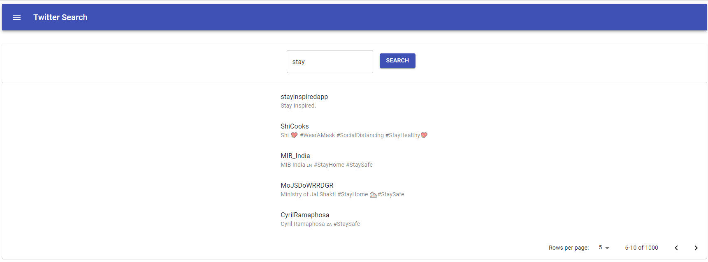

# twitter-search

This project demonstrates how to use twitter API. Users can search twitter using the web form.


The application uses the following technologies:
- Backend: NodeJs with an ExpressJs server
- Frontend: ReactJs 
- State Management: Redux
- Type Checking: Typescript



## Getting Started

To run this project you will need a twitter developer account

Please visit https://developer.twitter.com/en/docs/twitter-api for more information

Set the following environment variables:
```
-  TWITTER_CONSUMER_KEY: Access Token
-  TWITTER_CONSUMER_SECRET: Access token secret 
-  TWITTER_ACCESS_TOKEN_KEY: API key
-  TWITTER_ACCESS_TOKEN_SECRET: API key secret
```

build the static code
```
cd ./client
npm install
npm run build
```

run the server
```bash
cd ./server
npm install
npm start
```

The server runs on port `3001`.

There are three routes:
```
- http://localhost:3001/                                   - homepage
- http://localhost:3001/api/users/search?q=<query>         - accepts GET requests for twitter search with <query> query
- http://localhost:3001/api/users/show?q=<id>              - accepts GET requests for getting user details with <id> query
```

## Scripts

### Server

```
- npm run tslint           - will run the linter checks
- npm test                 - will run all the tests
- npm run coverage         - will generate code coverage reports
- npm run build            - will generate generate .js from the .ts files for production use
- npm run build:watch      - will generate generate .js from the .ts files for production use and watch for changes
- npm run dev              - will run the dev server
- npm start                - will start the production server
```

### Client

```
- npm run build            - will run webpact to generate static content out of jsx
- npm test                 - will run all the tests
- npm run eject            - will give access to all config files
- npm start                - will start the dev server
```

## Project Structure

### Overall Structure

1. The project is devided in to two main directories. 
2. The `server` directory contains the express server as well as all the helper classes.
3. The `client` directory contains the reactjs Frontend code.

### Server Structure

1. The `server/tests` directory contains all the unit and integration tests for the Backend server.
2. The `server/src` directory contains the route handler, the main app.ts and services.
3. The `server/logs` directory contains the access.log.
4. The `server/dist` directory contains all compiled js files.
5. The `server/public` directory contains all the static files generated by webpack build.

### Client Structure

1. The `client/src/App.tsx` directory contains the root react component for the Frontend.
2. The `client/src/tests` directory contains all the tests.

## Development

This project uses tsLint to detect suspicious code in JavaScript files. Visit https://palantir.github.io/tslint/ for details.

### Testing

This project uses jest and supertest for testing.
Visit https://jestjs.io/ and https://www.npmjs.com/package/supertest for details.

To execute tests:

```bash
npm test
```

To calculate coverage:

```bash
npm run coverage
```

The coverage reports will be in the `coverage` folder

### Dev Server

To run the development express server and start `nodemon`:

```bash
cd server
npm run dev
```

To run the development react server:

```bash
cd client
npm start
```

## FAQ

## Credits

Written by Shahriar Hasan Khan
Contact: shahriar27@hotmail.com
